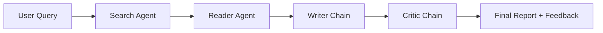

# 🔬 ResearchMind - Multi-Agent AI Research System

[](https://multiagentsystems.streamlit.app/)
[](https://www.python.org/downloads/)
[](https://opensource.org/licenses/MIT)
[](https://www.langchain.com/)

A sophisticated multi-agent AI system that orchestrates four specialized agents to conduct comprehensive research on any topic. Built with LangChain, Mistral AI, and Streamlit.

## 🌟 Live Demo

**Try it now:** [https://multiagentsystems.streamlit.app/](https://multiagentsystems.streamlit.app/)

## ✨ Features

- **🔍 Search Agent** - Discovers recent and reliable web information using Tavily Search API
- **📄 Reader Agent** - Scrapes and extracts deep content from top resources
- **✍️ Writer Chain** - Drafts comprehensive, well-structured research reports
- **🧐 Critic Chain** - Reviews and scores reports with constructive feedback
- **🎨 Modern UI** - Beautiful, responsive interface with real-time pipeline visualization
- **⚡ Fast & Reliable** - Powered by Mistral AI's latest large language model

## 🎯 How It Works



1. **Search Agent** queries the web for recent information
2. **Reader Agent** scrapes the most relevant URLs for deeper content
3. **Writer Chain** synthesizes gathered data into a structured report
4. **Critic Chain** evaluates the report and provides improvement suggestions

## 🚀 Quick Start

### Prerequisites

- Python 3.14 or higher
- Mistral AI API key ([Get it here](https://console.mistral.ai/))
- Tavily Search API key ([Get it here](https://tavily.com/))

### Installation

1. **Clone the repository**
   ```bash
   git clone https://github.com/NishchayVashishtha/Multi-Agent-System.git
   cd Multi-Agent-System
   ```

2. **Create a virtual environment**
   ```bash
   python -m venv venv
   
   # Windows
   venv\Scripts\activate
   
   # macOS/Linux
   source venv/bin/activate
   ```

3. **Install dependencies**
   ```bash
   pip install -r requirements.txt
   ```

4. **Set up environment variables**
   
   Create a `.env` file in the project root:
   ```env
   MISTRAL_API_KEY=your_mistral_api_key_here
   TAVILY_API_KEY=your_tavily_api_key_here
   ```

5. **Run the application**
   ```bash
   streamlit run app.py
   ```

6. **Open your browser**
   
   Navigate to `http://localhost:8501`

## 📦 Project Structure

```
Multi-Agent-System/
│
├── app.py                 # Streamlit UI and main application
├── agents.py              # Agent definitions and chains
├── tools.py               # Custom tools (search & scraping)
├── pipeline.py            # CLI-based research pipeline
├── requirements.txt       # Project dependencies
├── .env.example          # Example environment variables
├── .gitignore            # Git ignore rules
└── README.md             # This file
```

## 🛠️ Technologies Used

| Technology | Purpose |
|------------|---------|
| **LangChain** | Agent orchestration and chain management |
| **Mistral AI** | Large language model (mistral-large-latest) |
| **Streamlit** | Web interface and deployment |
| **Tavily API** | Real-time web search |
| **BeautifulSoup4** | Web scraping and content extraction |
| **Python 3.14** | Core programming language |

## 📖 Usage Examples

### Web Interface

1. Visit [https://multiagentsystems.streamlit.app/](https://multiagentsystems.streamlit.app/)
2. Enter your research topic (e.g., "Quantum computing breakthroughs in 2025")
3. Click "⚡ Run Research Pipeline"
4. Watch the agents work in real-time
5. Download the final report as markdown

### Command Line Interface

```bash
python pipeline.py
```

Then enter your research topic when prompted.

## 🎨 UI Preview

The application features:
- **Hero Section** - Clean, modern landing with topic input
- **Pipeline Visualization** - Real-time status of each agent
- **Results Panel** - Expandable sections for raw outputs
- **Final Report** - Beautifully formatted markdown report
- **Critic Feedback** - Detailed scoring and suggestions
- **Download Option** - Export reports as `.md` files

## 🔧 Configuration

### Changing the LLM Model

Edit `agents.py`:
```python
llm = ChatMistralAI(
    model="mistral-large-latest",  # or "mistral-medium", "mistral-small"
    temperature=0
)
```

### Adjusting Search Results

Edit `tools.py`:
```python
results = tavily.search(query=query, max_results=5)  # Change max_results
```

### Customizing Scraping Length

Edit `tools.py`:
```python
return soup.get_text(separator=" ", strip=True)[:3000]  # Change character limit
```

## 🚀 Deployment

### Streamlit Cloud (Recommended)

1. Push your code to GitHub
2. Go to [share.streamlit.io](https://share.streamlit.io)
3. Connect your repository
4. Add secrets in the Streamlit dashboard:
   ```toml
   MISTRAL_API_KEY = "your-key"
   TAVILY_API_KEY = "your-key"
   ```
5. Deploy!

### Other Platforms

- **Railway**: Deploy with one click, add environment variables
- **Render**: Use start command `streamlit run app.py --server.port=$PORT`
- **Hugging Face Spaces**: Create a Streamlit space and upload files

## 📊 Performance

- Average research time: **30-60 seconds**
- Search results: **5 top sources**
- Scraped content: **Up to 3000 characters per URL**
- Report length: **500-1500 words** (varies by topic)

## 🤝 Contributing

Contributions are welcome! Please feel free to submit a Pull Request.

1. Fork the repository
2. Create your feature branch (`git checkout -b feature/AmazingFeature`)
3. Commit your changes (`git commit -m 'Add some AmazingFeature'`)
4. Push to the branch (`git push origin feature/AmazingFeature`)
5. Open a Pull Request

## 🐛 Known Issues

- Some websites may block scraping attempts
- Very long research topics may exceed token limits
- Rate limiting may occur with free API tiers

## 📝 Future Enhancements

- [ ] Support for multiple LLM providers (OpenAI, Anthropic, etc.)
- [ ] PDF export option
- [ ] Research history and bookmarking
- [ ] Collaborative research sessions
- [ ] Citation management
- [ ] Multi-language support

## 📄 License

This project is licensed under the MIT License - see the [LICENSE](LICENSE) file for details.

## 👤 Author

**Nishchay Vashishtha**

- GitHub: [@NishchayVashishtha](https://github.com/NishchayVashishtha)
- Project: [Multi-Agent-System](https://github.com/NishchayVashishtha/Multi-Agent-System)
- Live Demo: [multiagentsystems.streamlit.app](https://multiagentsystems.streamlit.app/)

## 🙏 Acknowledgments

- [LangChain](https://www.langchain.com/) for the amazing agent framework
- [Mistral AI](https://mistral.ai/) for the powerful language model
- [Tavily](https://tavily.com/) for the search API
- [Streamlit](https://streamlit.io/) for the easy-to-use web framework

## 📞 Support

If you have any questions or run into issues:

1. Check the [Issues](https://github.com/NishchayVashishtha/Multi-Agent-System/issues) page
2. Create a new issue if your problem isn't already listed
3. Star ⭐ the repository if you find it useful!

---

<div align="center">

**Built with ❤️ using LangChain, Mistral AI, and Streamlit**

[⭐ Star this repo](https://github.com/NishchayVashishtha/Multi-Agent-System) | [🐛 Report Bug](https://github.com/NishchayVashishtha/Multi-Agent-System/issues) | [✨ Request Feature](https://github.com/NishchayVashishtha/Multi-Agent-System/issues)

</div>
